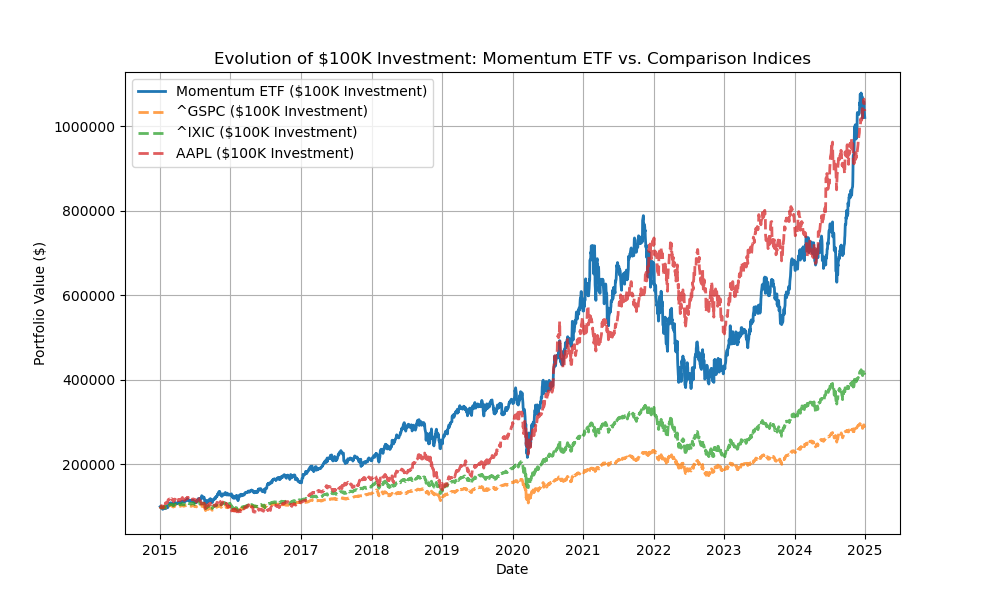

**Google Trends Momentum ETF -- Exploration**

{width="485"}

**Interactive app:** <https://gtrends-momentum-etf.streamlit.app/>

**\* Just an experiment, not financial advice\***

**Idea & Motivation**

-   Can search trends predict stock performance? The idea has been tested before, but with mixed results.

-   Instead of applying it to the entire stock market, this focuses on digital-first companies---where online visibility is closely tied to revenue.

-   Inspired by Glen Allsopp's fictional SEO ETF, which outperformed the S&P 500 significantly.

-   The core hypothesis: If a company's search volume is rising, does that indicate growing market interest and potential stock performance?

**How It Was Built**

-   **Market Selection & Stock Universe**

    -   Focused on public digital-first companies (e.g., [Booking.com](https://Booking.com), Airbnb, HubSpot, Intuit) based on a curated list available at [gaps.com/public](www.gaps.com/public)

    -   Major indices like the S&P 500 and Nasdaq were used for benchmarking.

-   **Backtesting Approach**

    -   Used a 10-year period (2015--2024) to test the concept.

    -   A momentum strategy was applied, updating the portfolio every 6 months.

    -   Unlike traditional momentum strategies that rely on stock price movements, this one uses search trends:

        -   If search interest for a stock increased, it was added to the portfolio.

        -   If interest dropped, it was removed.

-   **Weighting Methods**

    -   Market Cap Weighted -- Larger companies received a bigger share.

    -   Equal Weighted -- Every stock in the portfolio got the same allocation.

    -   Slope Weighted -- Stocks were weighted based on how fast their search interest was increasing.

-   **Tech Details & Data Processing**

    -   Pulled Google Trends data for stock names and calculated the slope of search interest.

    -   Standardized data formats and removed inconsistencies in ticker symbols.

    -   Used half-year periods (January--June, July--December) as distinct testing windows.

    -   If no valid stocks were available in a given period, the previous portfolio value was carried forward.

**Results & What Was Observed**

-   **Performance vs. Traditional Indices**

    -   The strategy outperformed major indices in multiple periods, particularly in bull markets.

    -   It struggled during downturns, as expected from momentum-based approaches.

    -   Just as a point of reference the return would almost exactly match the return of investing in Apple stock in 2015.

    -   {width="458"}

-   **Most Frequently Picked Stocks**

    -   [Booking.com](https://Booking.com) (BKNG) Intuit (INTU) and HubSpot (HUBS) frequently appeared.

    -   Bucklet (a small online retailer) appeared more than any other startup but had less impact due to its smaller market cap.

        

**Caveats & Limitations**

-   **Momentum = High Volatility**

    -   Many selected stocks were small- to mid-cap, leading to bigger price swings.

    -   Like most momentum strategies, this approach had big gains in strong markets but struggled in downturns.

-   **Seasonality is a Factor**

    -   Some industries naturally see spikes in search volume at certain times of the year:

        -   Consumer electronics: Searches surge before product launches.

        -   Energy stocks: Trends react to market shocks.

        -   Tech & SaaS: More stable search interest, leading to longer momentum cycles.

-   **Survivorship Bias**

    -   The dataset only includes stocks that still exist today, ignoring bankrupt or acquired companies.

-   **Real-World Challenges**

    -   Frequent rebalancing leads to trading costs, taxes, and potential execution delays.

-   **If It Works, Why Isn't Wall Street Doing It?**

    -   They are, hedge funds and quant firms already use search trends, social sentiment, and web traffic in their models.

**Role in an AI-Driven World**

-   **AI vs. Search Data for Market Insights**

    -   AI models analyze structured financial data efficiently (earnings reports, SEC filings, etc.).

    -   However, they may not capture real-time shifts in consumer attention.

    -   Search data provides a live signal of what people are interested in at any moment.

**Open Questions**

-   How do different lookback periods (3 months vs. 6 months vs. 12 months) affect results?

-   Can this approach work better in subsets of digital companies? e.g. companies where the lag from user intention to action tends to be longer, and therefore search signals become available much earlier than earnings reports, etc ?

-   Could results be improved by focusing on more specific terms related to the growth of a company (rather than the brand name) ?

-   What if Google Trend data were combined with other more granular search data source like the ones available exclusively to Google ads advertisers?
